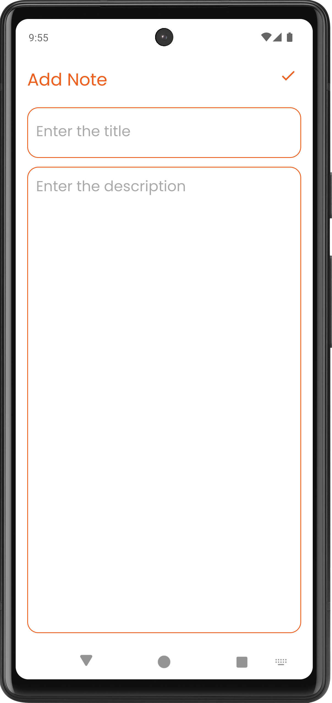

# NoteApp
# 📱 Kotlin XML Fragment SQLite App

Đây là một ứng dụng Android mẫu được phát triển bằng Kotlin, sử dụng **XML layout**, **Fragment**, và lưu trữ dữ liệu cục bộ bằng **SQLite**. Ứng dụng cho phép người dùng thêm, hiển thị và xoá thông tin (ví dụ: ghi chú, công việc, danh bạ, v.v.).

---

## 🛠️ Công nghệ sử dụng

- **Ngôn ngữ:** Kotlin
- **Giao diện:** XML Layout
- **Điều hướng:** Fragment
- **Cơ sở dữ liệu:** SQLite (SQLiteOpenHelper)

---

## 🎯 Tính năng

- Thêm mới dữ liệu vào SQLite.
- Hiển thị danh sách dữ liệu trong Fragment.
- Xoá mục khỏi cơ sở dữ liệu.
- Giao diện đơn giản, thân thiện.

## 💡 Giao diện người dùng

|  |  |
|:---------------------------------------:|:----------------------------------------------:|
| Màn hình Thêm dữ liệu                   | Màn hình Danh sách dữ liệu                     |
